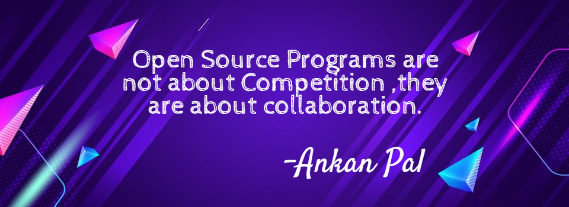

### ⭐Hi there, I'm Ankan Pal✅ 👋
<!--
  
-->

 
 
##  ⚡ ✅ I'm a full-time Software Developer and a part-time chess player 🔥

<h1 align="center">  </h1>

<!--<h1 align="center">  
</h1> -->

- 🔭 I am pursuing Computer Science and Engineering from the Institute of Engineering and Management, Kolkata.
- 🌱 I’m currently learning Backend development 🔥
- 👯 I’m looking to collaborate on projects
- 🤔 I’m looking for help with my projects!
- 💬 Ask me about my hobbies!😜
- 👯 I’m looking to collaborate with other content creators
- ✅ I have been invited as a guest speaker in several organizations.
- 🥅 2023 Goals: Contribute more to Open Source projects
- ⚡ Fun fact: I love to play chess and have played more than 25000 games at Lichess,Chess.com and Chess24.

### Please visit my Linkedin profile to know more about my skills,experience and achievements: ✅
<!--[][linkedin]-->
[][linkedin]

### Connect with me:

<!--[][twitter]
[][facebook]
[][instagram]
-->

[][twitter]
[][facebook]
[][instagram]

 

 
 
### Languages and Tools:  

**Front End:**
<code></code>
<code></code>
<code></code>
<code></code>
<code></code>
<code></code>
<code></code>

**Back End:**
<code></code>
<code></code>
<code></code>
<code></code>
<code></code>

**Dev Ops:**
<code></code>
<code></code>
<code></code>
<code></code>

**Android:**
<code></code>
<code></code>
<code></code>
<code></code>

**Problem Solving:**
<code></code>
<code></code>
<code></code>
<code></code>

 
 
 

<!-- Commented one is light theme github stats -->
<!---->

  <!-- -->
  
<!---->
 
 

<!--

 
 

-->
 
 
<!-- ## A Quotation that always inspires me: ✅ -->

<!-- -->
<!--
-->

   <!-- Github story in 3D https://skyline.github.com/-->
<!---->

[twitter]: https://twitter.com/ankan1811
[instagram]: https://instagram.com/the_arithmetic_progression
[linkedin]: https://linkedin.com/in/ankanpal
[facebook]: https://facebook.com/ankan.pal.73
